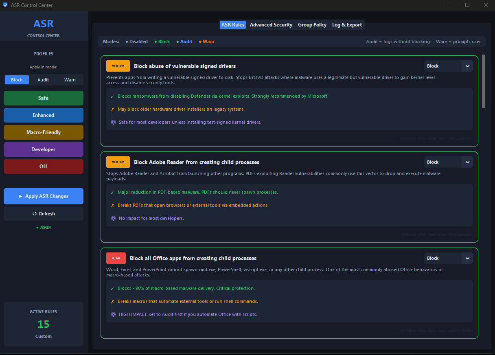

# ASR Control Center

A management GUI built with Python and CustomTkinter designed to configure, monitor, and manage Windows Defender Attack Surface Reduction (ASR) rules, advanced security settings, and critical Windows Group Policies.




---

## Features

- **Full 17-Rule ASR Management:** Easily toggle and configure all official Microsoft Attack Surface Reduction rules.
- **Operational Mode Control:** Switch rules effortlessly between **Block**, **Audit**, **Warn**, and **Disabled** states.
- **Predefined Security Profiles:** Quick-apply safe, enhanced, developer, or macro-friendly security templates.
- **Advanced Defender Settings:** Manage Controlled Folder Access, Network Protection, PUA protection, and cloud-delivered protection.
- **Group Policy Hardening:** Quickly apply or revert critical registry security tweaks (such as disabling `AlwaysInstallElevated` and enforcing UAC).
- **Activity Logging & Export:** Keep track of applied modifications with built-in log rotation and JSON configuration export/import tools.

---

## Download & Usage Options

Visit the **[Releases](../../releases)** section to choose how you want to run the application:

### Option 1: Standalone Executable (Out of the Box)
- **Direct Executable (`ASR-ControlCenter.exe`):** Download and right-click to select **Run as Administrator**. No extraction or Python installation required.
- **ZIP Archive (`ASR-ControlCenter.zip`):** Contains the standalone `.exe` inside a compressed archive. Recommended if your browser or network blocks direct `.exe` downloads.

### Option 2: Python Script & Launcher Bundle (.zip)
- Download `ASR-ControlCenter-Source.zip` from the latest release.
- Extract the archive to get both `ASR-ControlCenter.py` and `Launch-ASR.bat`.
- Double-click `Launch-ASR.bat` to automatically launch the application with administrative elevation.

### Option 3: Raw Python Script (.py)
- Best for developers who want to inspect or modify the source code directly.
- Download `ASR-ControlCenter.py`.
- **Requirements:** Python 3.8+ and `customtkinter` (`pip install customtkinter`).
- Run via PowerShell or Command Prompt with elevated rights:
  ```bash
  python ASR-ControlCenter.py
